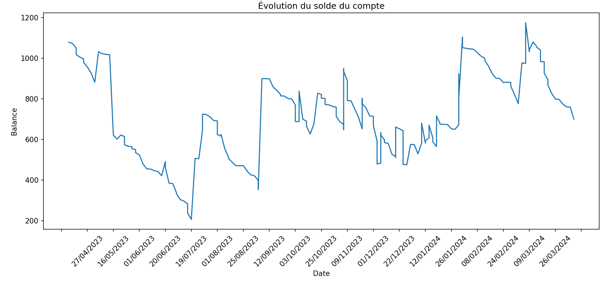
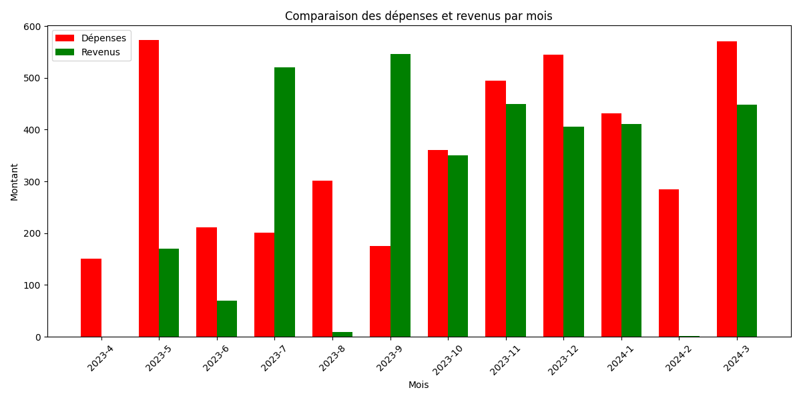

# Banque analytics

Ce script Python vous permet d'analyser les données de votre banque pour voir vos dépenses par catégories, votre solde à chaque transaction, etc.  
Les banques prisent en charge sont celles qui fournissent un fichier CSV avec les colonnes suivantes : `Date`, `Categorie`, `Debit`, `Credit`. Banques connues :  
- Banque Populaire
- Crédit Agricole
- Fortuneo

Graphiques disponibles :
- Evolution du solde à chaque transaction (voir figure ci-dessous)
- Comparaison dépenses/revenus par mois (voir figure ci-dessous)
- Montant des dépenses par catégories
- Nombre de transaction par catégories

### Utilisation
1. Téléchargez votre fichier d'opérations au format CSV et placez le dans le dossier `compte/` (Pour la banque Populaire : Compte -> Télécharger les opérations -> Format CSV, format de date : JJ/MM/AAAA, séparateur : point-virgule, séparateur décimal : virgule).
    - Si vous avez plusieurs fichiers CSV, le script va automatiquement les fusionner.
2. Dans `banque.py`, définissez votre solde __actuel__ à la ligne 196 (`solde_actuel = 1000` par exemple).
3. Lancez le script avec `python banque.py`.  

Les graphiques seront enregistrés dans le dossier `figures/`.

### Autres banques
Si vous souhaitez utiliser les données d'une autre banque, téléchargez votre fichier d'opérations au format CSV et assurez vous que ce dernier contienne les colonnes pour la date, le débit, le crédit et la catégorie (optionel).  
Vous pouvez ensuite modifier la fonction `detect_bank(df)` et ajouter les colonnes de votre banque dans le dictionaire `banques`, puis ajouter les colonnes à garder dans `colonnes_banque`.

### Exemple de graphiques

